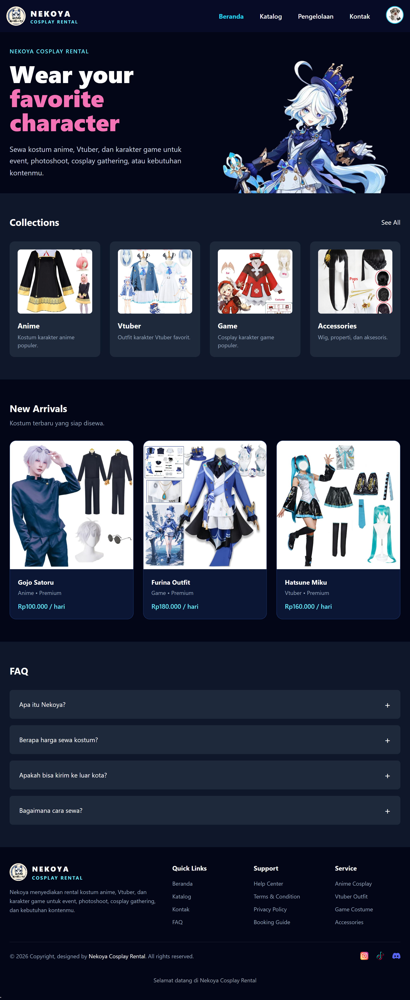
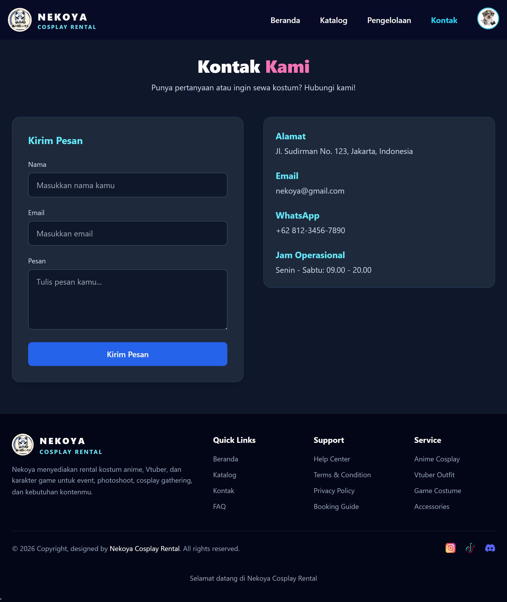
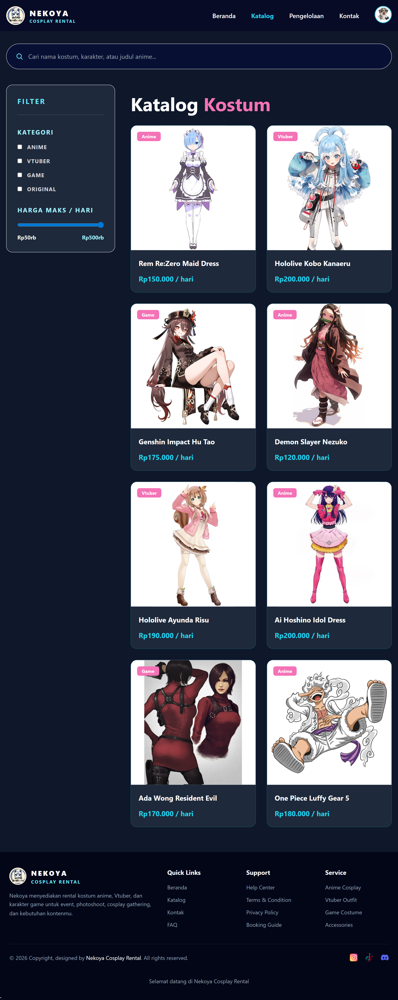
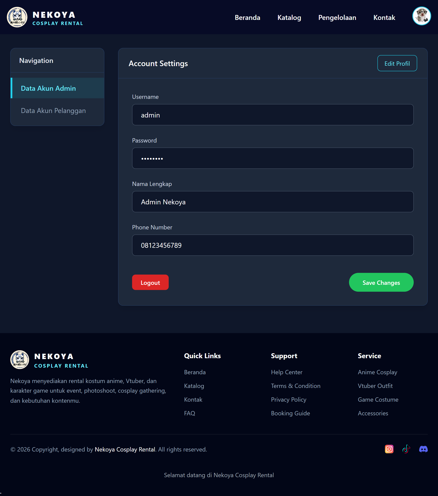
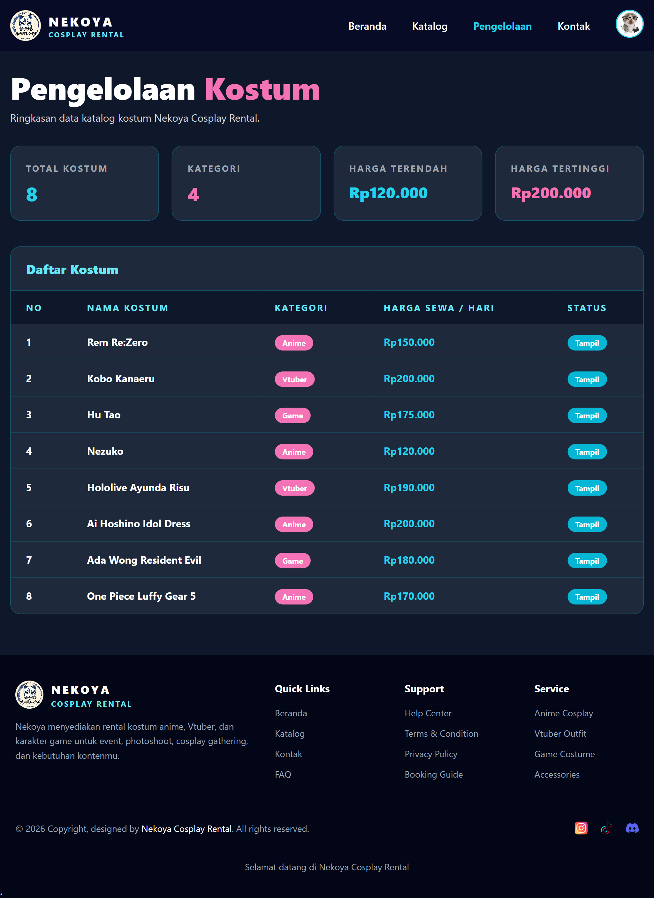
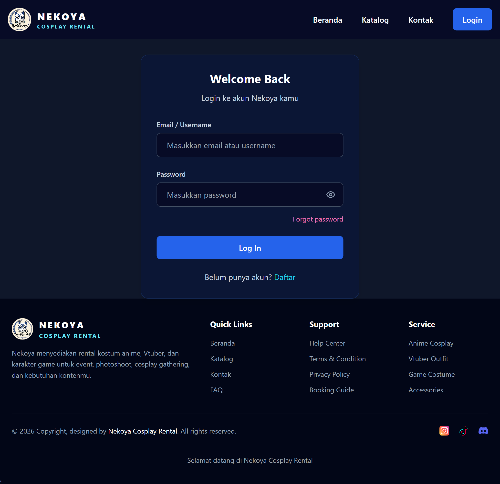

# Nekoya Cosplay Rental

## Deskripsi Project
Nekoya Cosplay Rental adalah sebuah website penyewaan kostum cosplay yang memungkinkan pengguna untuk melihat katalog kostum, mencari kostum berdasarkan kategori dan harga, serta menyediakan fitur login admin untuk mengelola data kostum.

Website ini dibuat sebagai project menggunakan framework Laravel dengan konsep MVC (Model View Controller).

---

## Teknologi yang Digunakan
- Laravel (Backend Framework)
- Blade Template Engine
- Tailwind CSS (Styling)
- JavaScript (Interaksi & Filter)
- PHP

---

## Fitur Utama
- Login Admin
- Halaman Dashboard
- Katalog Kostum + Filter & Search
- Halaman Profil Admin
- Halaman Pengelolaan Data Kostum
- Halaman Kontak
- Responsive Navbar & Mobile Menu

---

## Screenshot Website

### 1. Halaman Dashboard

### 2. Halaman kontak

### 3. Halaman Katalog

### 4. Halaman Profil

### 5. Halaman Pengelolaan

### 6. Halaman Login

